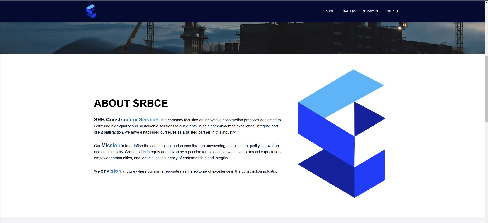
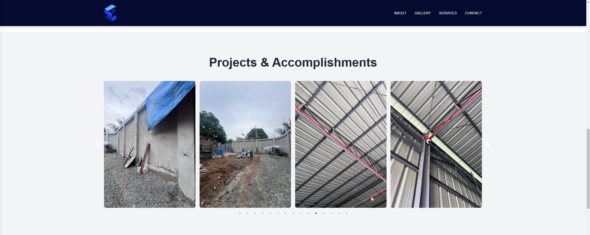
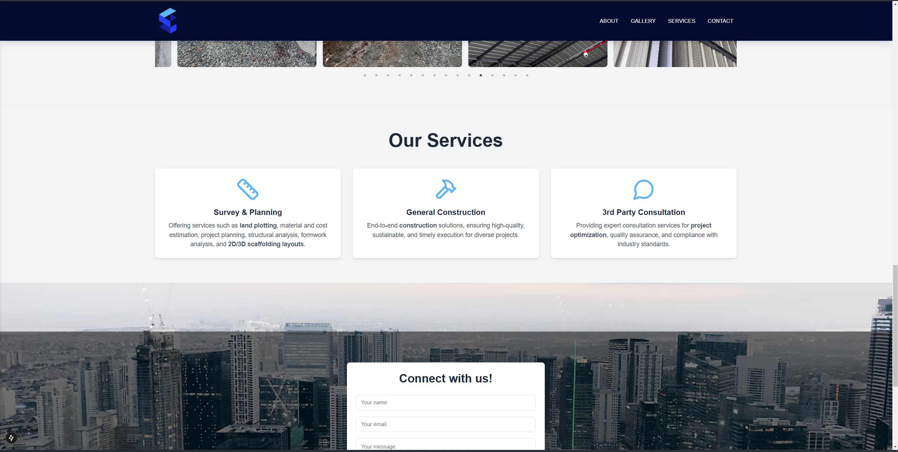
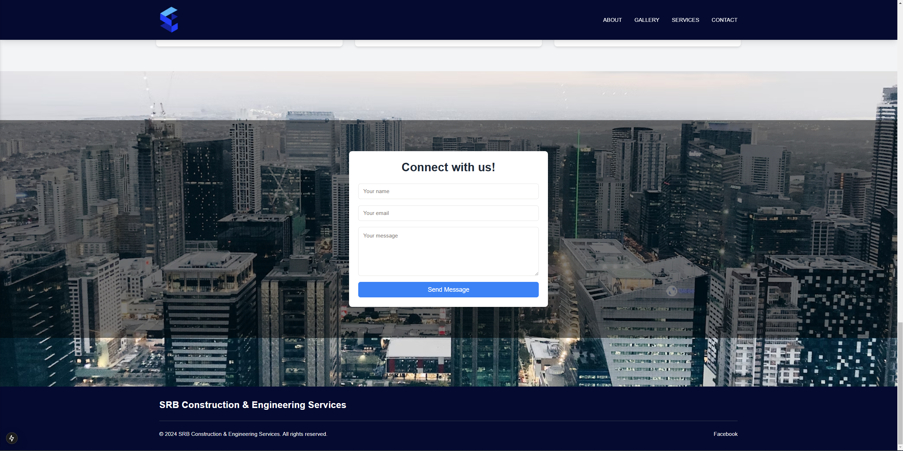

# SRB Construction & Engineering Services Website

## Table of Contents

- [Introduction](#introduction)
- [Features](#features)
- [Technologies Used](#technologies-used)
- [Views](#views)

---

## Introduction

The SRB Construction and Engineering Services website is a fully responsive, modern, and interactive one-page website designed to showcase SRB Construction & Engineering Services' projects, services, and contact information. Built with scalability, responsiveness, and user engagement in mind, this project reflects the company's commitment to quality and excellence.

---

## Features

- **Responsive Design**: Ensures seamless viewing across all devices.
- **Interactive Services Section**: Cards with descriptive overlays for each service.
- **Project Gallery**: A functional carousel with a lightbox for better visualization of successful projects.
- **Contact Form**: A simple and effective form to facilitate communication with clients.
- **About Us Section**: Highlights the company's background and mission.
- **Scroll Animations**: Adds a modern touch with subtle visual effects.

---

## Technologies Used

- **Frontend**: Next.js, React, Tailwind CSS, Shadcn UI, Figma
- **Backend**: Google APP Password for Contact Form Functionality
- **Deployment**: TBA

## Views

Header + Hero section

About section

Gallery Section

Contact Form

Footer Section

